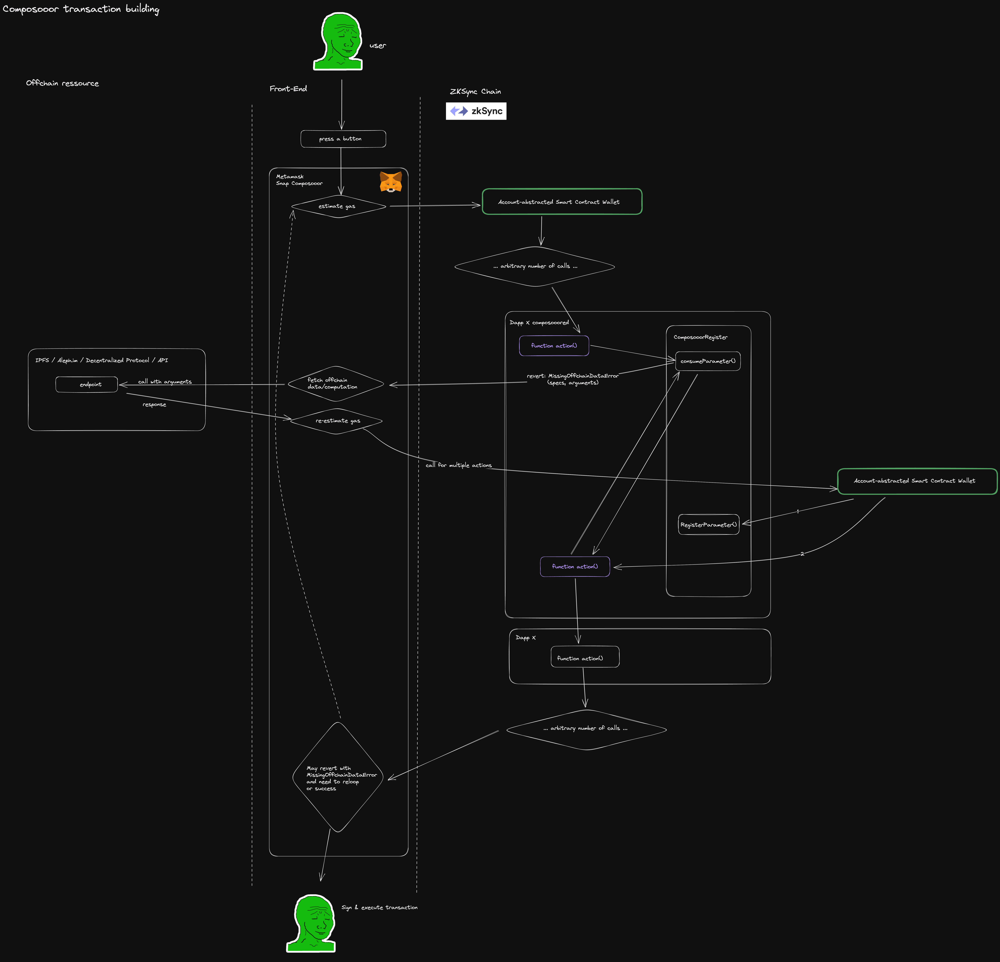

# Composooor

Composooor is a library enabling composability between previously imcompatible Dapps.

## Problem

Most modern Dapps are reliant on off chain data/computation to function.

- OpenSea needs seller/buyer signatures to execute transfers.
- Blur is the same.
- Kairos Loan needs signatures of loan offers to provide liquidity against NFTs.
- NFTfi is the same.
- Uniswap needs an api to figurate the best route for a trade.
- It's the same for aggregators such as 1inch/Paraswap/LLamaSwap etc.
- You need a merkle proof to claim your farmed Morpho tokens.
- It's the same for all airdrops.

Developing a smart contract using those systems just won't work, as EVM can only access onchain ressources.
DeFi effectively evolved to an incomposable state. Worse than this, developers often don't ever try to
build some projects as blockchains and rollups are limited in the data and computation they can handle.
What is there was a way to let the blockchain only check validity of actions and offload all heavy storage
and computation offchain in a composable way ? This would enable composably :

- Contract access to unlimited storage.
- Contract access to unlimited computation & solutions to optimization problems.

## Solution

Meet Composooor.
Composoor is a front-end and smart-contract library made to build hybrid on & off chain composable apps.
Building a smart contract that must interact with an hybrid app (e.g OpenSea)? A one-line import of the
corresponding composooor adapter does the trick ([example](../../example/contract/contracts/MarketPlaceComposooored.sol)). Want to leverage offchain power inside your smart contract
without breaking composability? One line import of [Composooor register](./src/sol/ComposooorRegister.sol).
Need a front-end for all that? One line import of [useComposooor](./src/ts/composooor.ts).

## How it works


Composooor design is based on a standardized way for smart contracts to signal missing data that should
come from an off chain ressource at transaction-preparation time.

- When preparing a transaction, our metamask snap wallet will request an estimate gas call on the desired on chain contract.
- If the contract needs some data or computation made off chain to function, it will revert with a standardized error containing specs on how to find this missing data.
- The wallet can then decode this error and finds the missing data either by fetching it on a decentralized
protocol, or on an API, or by executing some code it fetched from this sources to produce it.
- The wallet will then estimate gas again, this time adding an instruction to store the fetched data
in the standardized registry of the corresponding contract before calling the desired method.
- In the transaction execution the same or another contract may need another off chain ressource to function.
If it's the case, the wallet loops on the transaction preparation steps until no offchain ressource is needed
anymore.
- When the gas estimation is successful, the user is prompted with the signature of the prepared transaction,
to execute successfully with all necessary ressources included.

## Develop with composooor: Front end dev

Import with `import {useComposooor} from "@composooor/composooor"`.  
Example usage:

```typescript
const { write, data: dataComposooor } = useComposooor({
    address: dappAddress,
    abi: dapp.abi,
    functionName: "action",
    args: [],
});
```

`write()` will start the transaction.
useComposooor is made for [react](https://reactjs.org/) with [wagmi](https://wagmi.sh/).

## Develop with composooor: Smart Contract dev

Import with `import "@composooor/ComposooorRegister.sol";`.  
Example usage :

```solidity
contract Example is ComposooorRegister {
    function action() public {
        bytes memory data = consumeParameter("http://api.api/number", abi.encode(arguments));
        (uint256 offchainNumber) = abi.decode(data, (uint256));
        (...)
    }
}
```

`ComposooorRegister` is made with solidity.
